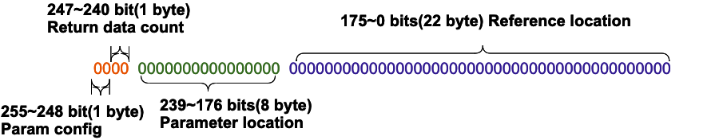
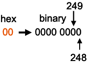
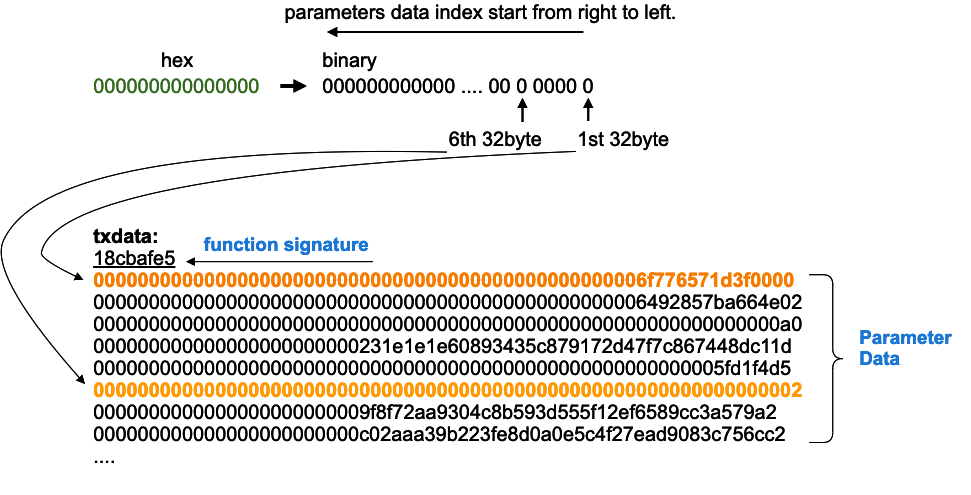
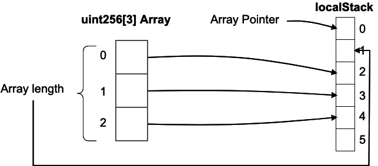
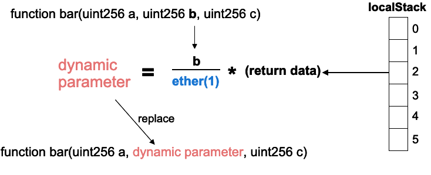

# Chained Input Guideline

Chained Input if for handling the calling parameter of Furucombo dynamically. The details includes config setup and common use cases. Please make sure to review the document.

## Structure

- Proxy
  - Storage
    - `bytes32[] public stack`
    - `mapping(bytes32 => bytes32) public cache`
  - Memory
    - `bytes32[] memory localStack`
      - Store return data stack.

## Config

config is a bytes32 data represented by hex.



### Param config



- `255-248` bits are reserved for parameter config.
- `248`: 1 if the parameter is dynamic, 0 if the parameter is static.
- Example:
  - `0x00` => `(b00)`: static parameter.
  - `0x01` => `(b01)`: dynamic parameter.

### Return data count

- `247-240` bits are reserved for return data count.
  - Expected return data count after a cube is executed.
  - `0` if the return data will not be referenced.
  - Example:
    - `0x04` => the return data of the cube will be referenced and the return data count is 4.
    - `0x00` => the return data of the cube will `not` be referenced.

### Parameter location



- `239-176` bits are reserved for parameter location.
- Every `bit` indicates which bytes32 (exclude 4-byte function signature) of parameter data should be replaced.
- 1 if the 1st bytes32 of parameter data will be replaced with return data, 0 if not.
- Example:
  - `0x01` => `(b001)` => replace the 1st bytes32 of parameter data with return data.
  - `0x03` => `(b011)` => replace the 1st bytes32 and the 2nd bytes32 of parameters data with return data.
  - `0x04` => `(b100)` => replace the 3rd bytes32 of parameter data with return data.

### Reference location


- `175-0` bits are reserved for Reference location.
- Every `byte` indicates which bytes32 of `localStack` contains the referenced data.
- Should be `ff` if the location is not used.
- Parameter data replacement order is from right to left except `ff`.

## Common Cases

- Static parameter, no return data
  - `0x0000000000000000000000000000000000000000000000000000000000000000`
- Static parameter, 1 return data
  - `0x0001000000000000000000000000000000000000000000000000000000000000`
- Dynamic parameter, no return data, the 2nd bytes32 of parameter data will be replaced with `localStack[0]`
  - `0x0100000000000000000200ffffffffffffffffffffffffffffffffffffffffff`

## Return Data Type

Return data fall into two broad categories: `Value` and `Reference`.

### Value Type

Value type return data will store in `localStack` in order (non-array).
Ex.

- `uint256`
- `bytes32`
- `bool`
- ...


### Reference Type

Reference type (dynamic array) includes `2` extra data(`pointer` and `length`) except `data`. Every reference type return data count is `+2`, `+1` increased by every data. . `pointer` store in the original position, `length` and `data` will store the location that `pointer` pointer in order.
Ex.

- `uint256[]`
- `address[]`
- `uint8[]`
- ..

**Example**

`returns(uint256 a, uint8[] memory b, bytes32 c)`

```
a           = 1
b.length    = 3
b[0]        = 2
b[1]        = 3
b[2]        = 4
c           = 0x0000000.....0F
```

return data will be:

```
returnData.length = 1 + (2 + 3) + 1 = 7
returnData[0] = 1
returnData[1] = pointer (returnData[3] address)
returnData[2] = 0x0000000.....0F
returnData[3] = length (useless)
returnData[4] = 2
returnData[5] = 3
returnData[6] = 4
```



## Percentage of dynamic parameter

`dynamic parameter = return data * percentage, 0 < percentage <= 1`



Replace the original parameter with **fraction** if using a dynamic parameter. The fraction will be divided by `ether(1)` for getting the **percentage** of return data.

- fraction
  - `uint256` type
  - denominator is `ether(1)`
  - `0 <= fraction <= ether(1)`
  - `0` if replace parameter with the exact same return data.

**Example**

- Replace second parameter with 50% of return data.
  - `function bar(a, ether(0.5), c)`
- Replace first parameter with 70% of return data.
  - `function bar(ether(0.7), b, c)`
- Replace first parameter with 100% of return data.
  - `function bar(0, b, c)`

## Preparation before using dynamic parameter

- Knowing the config setup details.
- Knowing the return data (type and count) of every cube.
- Knowing the index of every return data in `localStack`.
- Knowing which cube return data will be referenced.
- Knowing which cube need to use dynamic parameter.
